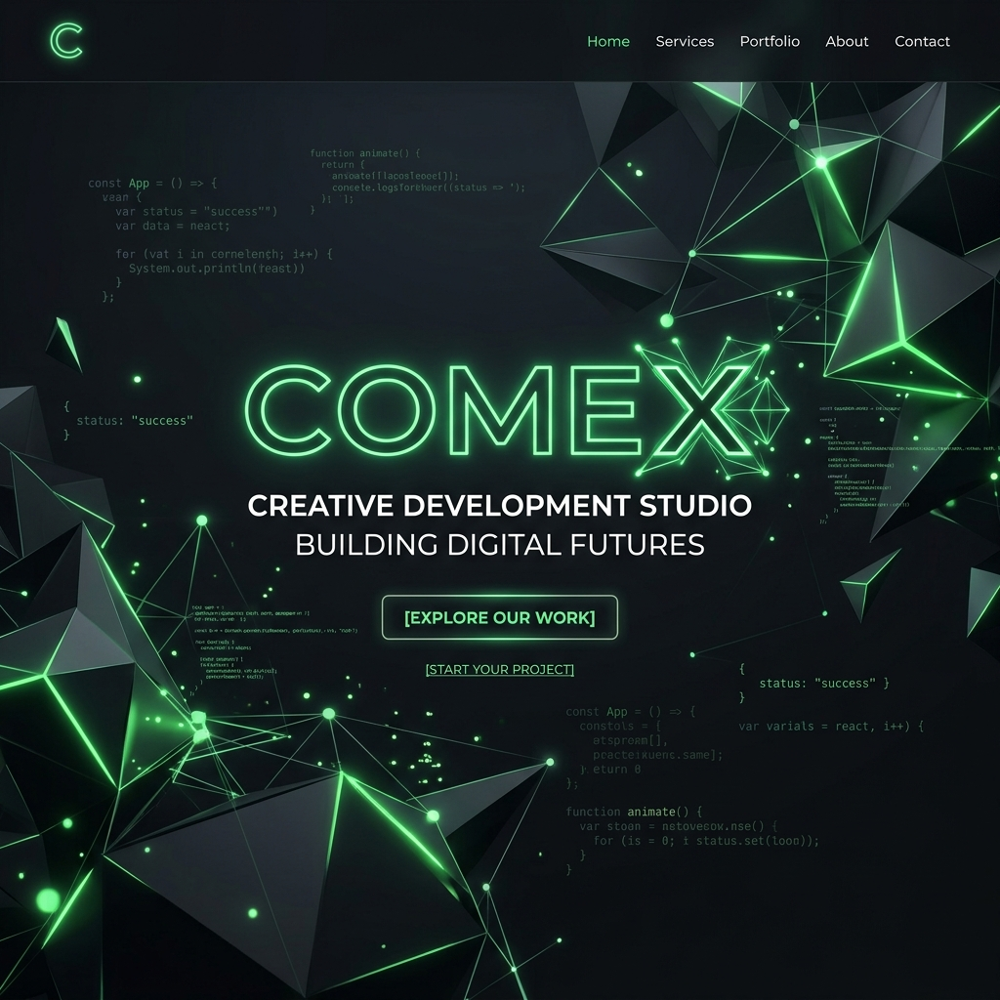

# Comex — Creative AI Development Studio

<div align="center">
  
</div>

<br />

<div align="center">
  <strong>A premium creative development studio  — highly optimized, modular structure, maximum impact.</strong>
</div>
<br />

<div align="center">
  <a href="https://firaseth.github.io/comex-portfolio/"><strong>Live Demo</strong></a> · 
  <a href="https://github.com/firaseth/comex-portfolio/issues">Report Bug</a> · 
  <a href="https://github.com/firaseth/comex-portfolio/issues">Request Feature</a>
</div>

---

## 🌟 Overview

Comex is a premium creative development studio  built to match the visual standards of Awwwards-level sites. It achieves a high-end, futuristic aesthetic using **zero frameworks** and minimal dependencies. Everything is meticulously crafted with Vanilla HTML5, CSS3, and JavaScript to guarantee maximum performance and seamless interactive experiences.

## ✨ Key Features

| Feature | Description |
| --- | --- |
| **Particle Mesh System** | Canvas-based network with interactive physics (mouse-repel) and proximity lines. |
| **3D Hero Card** | Real-time perspective + rotateX/Y tracking cursor position with 6 floating parallax elements. |
| **Character Animation** | Staggered, per-letter entrance animations perfectly synced after splash screen. |
| **Infinite Marquee** | Smooth horizontal auto-scrolling services band that pauses dynamically on hover. |
| **Mouse-Following Glow** | A beautiful 700px radial gradient that smoothly tracks your cursor across the hero section. |
| **Custom Cursor** | Dual-layer smart cursor (outer ring + inner dot) featuring lerp smoothing and hover states. |
| **Magnetic Buttons** | Elements subtly shift toward the cursor, offering a deeply interactive feel. |
| **Theming System** | Full Dark & Light modes controlled via CSS variables, persisted gracefully via `localStorage`. |
| **Scroll Progress Bar** | A glowing accent bar anchored at the top of the viewport indicating reading progress. |
| **Staggered Reveals** | `IntersectionObserver`-driven scroll animations with organic `cubic-bezier` easing. |

## 📁 Architecture

A remarkably clean and robust structure:

```text
comex-portfolio/
├── .github/                 # GitHub specific configurations & workflows
├── assets/                  # Extracted assets
│   ├── css/                 # Extracted modular CSS
│   ├── js/                  # Extracted modular JavaScript
│   └── banner.png           # Project banner image
├── favicon.svg              # Scalable vector browser tab icon
├── humans.txt               # Team & technology credits
├── index.html               # The application core
├── manifest.json            # PWA installation support
├── package.json             # Project metadata & npm scripts
└── README.md                # Project documentation
```

## 🚀 Getting Started

Since Comex operates with zero build steps, running it locally is incredibly simple.

1. Clone the repository:
   ```bash
   git clone https://github.com/firaseth/comex-portfolio.git
   ```
2. Navigate into the directory:
   ```bash
   cd comex-portfolio
   ```
3. Open `index.html` in your browser, or serve it using your preferred local server:
   ```bash
   npx serve .
   ```

## 📄 License

Distributed under the MIT License. See `LICENSE` for more information.

---
<div align="center">
  <sub>Built with precision by Comex.</sub>
</div>
